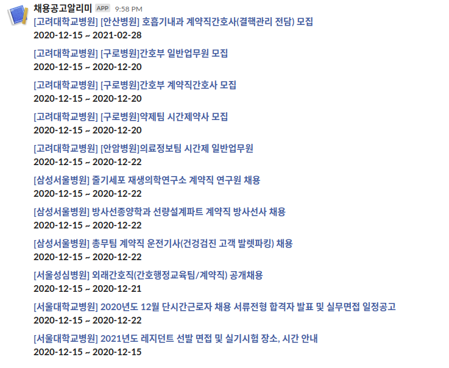

# Dream-Big

일반적으로 규모가 큰 회사들은 채용 공고를 자체 채용 사이트에 올립니다. 만약 관심 있는 회사가 있다면 `잡코X아`, `사X인` 같은 채용 중개 사이트를 이용하는 것 외에도, 주기적으로 그 회사의 채용 사이트를 직접 확인하는 것이 좋습니다.

하지만 매일매일 여러 회사들의 채용 사이트를 직접 확인하는 것은 힘들고 공고를 놓칠 위험이 있어 이 프로젝트를 만들게 되었습니다. 이 프로젝트는 하루에 한 번 내가 원하는 회사 채용 페이지를 파싱 하여 새 공고가 있을 경우 슬랙 메시지를 보내줍니다.

## 현재 지원되는 회사 목록
- 강동성심병원
- 고려대학교병원
- 경희대병원
- 삼성병원
- 서울성모병원
- 서울대학교병원
- 세브란스병원

## AWS Lambda를 사용하여 슬랙으로 새 채용 공고 알림받기

1. `Recruit.RecruitFactory`의 `makeAll`메소드에 알림을 받길 원하는 회사의 인스턴스를 넣어줍니다.
2. AWS Lambda Function을 만듭니다.
    - Runtime: `Java 11`
    - Handler: `Handler.CWEventHandler::handleRequest`
    - Environment variables:
        - SLACK_HOOK_URL: `your Slack webhook url`
    - Timeout: 기본 타임아웃은 짧기 때문에 적절히 늘려주세요.

3. gradle로 빌드하여 나온 결과물(`build/distributions/Dream-Big.zip`)을 AWS Lambda에 업로드 합니다.
4. CloudWatch Event 트리거를 추가합니다. 
    - Rule type: Schedule expression
        - Schedule expression: cron(0 0 * * ? *)
   

## 관심있는 회사 직접 추가하기

관심있는 회사가 아직 지원되지 않는다면 `Recruit.Company` 패키지에 `Recruit.RecruitAbstract`를 상속받은 클래스를 직접 구현하면 됩니다.

## TODO
- 배포 자동화
- 에러 로깅
